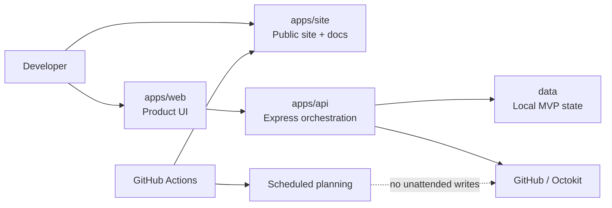

# ContributorOps

<p align="center">
  <picture>
    <source media="(prefers-color-scheme: dark)" srcset="./apps/site/public/contributorops-logo-dark.svg">
    <source media="(prefers-color-scheme: light)" srcset="./apps/site/public/contributorops-logo-light.svg">
    
  </picture>
</p>

<p align="center">
  <strong>Turn real open-source contributions into verifiable career proof.</strong>
</p>

<p align="center">
  <a href="https://github.com/AnkitParekh007/contributorOps/actions/workflows/ci.yml"></a>
  <a href="https://ankitparekh007.github.io/contributorOps/"></a>
  <a href="https://github.com/AnkitParekh007/contributorOps/stargazers"></a>
  <a href="https://github.com/AnkitParekh007/contributorOps/forks"></a>
  <a href="https://github.com/AnkitParekh007/contributorOps/issues"></a>
  <a href="./LICENSE"></a>
</p>

<p align="center">
  <a href="https://ankitparekh007.github.io/contributorOps/"><strong>Live product</strong></a>
  ·
  <a href="https://ankitparekh007.github.io/contributorOps/#/showcase"><strong>Engineering showcase</strong></a>
  ·
  <a href="https://ankitparekh007.github.io/contributorOps/#/recruiter"><strong>Recruiter brief</strong></a>
  ·
  <a href="https://ankitparekh007.github.io/contributorOps/#/contribute"><strong>Contribute</strong></a>
  ·
  <a href="https://ankitparekh007.github.io/contributorOps/#/share"><strong>Share</strong></a>
  ·
  <a href="./docs/architecture.md"><strong>Architecture</strong></a>
</p>

---

ContributorOps is an open-source contribution intelligence platform for developers who want to do meaningful OSS work and turn that work into evidence that maintainers and hiring teams can understand.

It structures the contribution loop as:

**Discover → Prepare → Validate → Human approval → Prove**

- discover role-relevant contribution opportunities
- prepare scoped plans, tests, maintainer questions, and PR narrative
- validate scope, quality, tone, and submission readiness
- keep external GitHub writes explicitly human-approved
- package finished work into portfolio evidence, resume bullets, and interview stories

> ContributorOps is intentionally **not** a mass-commenting bot, mass-PR engine, or contribution-gaming system. Maintainer trust is an architecture constraint.

## Why this repository is different

Many developer tools show features. ContributorOps also makes the **engineering decisions and growth rules** public.

| Evidence | What it demonstrates |
| --- | --- |
| [`docs/architecture.md`](./docs/architecture.md) | system surfaces, data flow, trust boundaries, CI, deployment, production evolution |
| [`docs/adr/`](./docs/adr/README.md) | durable reasoning behind high-impact architecture choices |
| [`docs/safety-policy.md`](./docs/safety-policy.md) | explicit rules for external GitHub actions and anti-spam behavior |
| [CI workflow](./.github/workflows/ci.yml) | API/Web/Site builds, TypeScript validation, secret-pattern checks |
| [Engineering Showcase](https://ankitparekh007.github.io/contributorOps/#/showcase) | how contribution work becomes explainable professional evidence |
| [Recruiter Brief](https://ankitparekh007.github.io/contributorOps/#/recruiter) | two-minute path from product story to architecture and source evidence |
| [Share Hub](https://ankitparekh007.github.io/contributorOps/#/share) | audience-specific project sharing without mass-posting generic promotion |
| [`docs/distribution-playbook.md`](./docs/distribution-playbook.md) | GitHub-first discovery, release-driven distribution, conversion and anti-spam rules |
| [`CONTRIBUTORS.md`](./CONTRIBUTORS.md) | contribution recognition without commit-count leaderboards |
| [`CITATION.cff`](./CITATION.cff) | native repository citation metadata |

## For developers

GitHub activity alone is noisy. ContributorOps turns contribution work into a repeatable workflow.

| Developer problem | ContributorOps response |
| --- | --- |
| “Which OSS issue is worth my time?” | role-aware issue discovery and scoring |
| “I lose context before I finish.” | structured contribution plans and daily missions |
| “My PR is technically fine but poorly communicated.” | PR-quality and maintainer-readiness checks |
| “I do not want automation spamming maintainers.” | explicit human approval before external writes |
| “My contribution disappears into GitHub history.” | proof-of-work portfolio and career packaging |

If you would use this workflow, star the repository. If you want a different contribution model, fork it and extend the intelligence layer without removing the trust boundary silently.

## For recruiters and engineering leaders

ContributorOps is also a public engineering/product case study spanning:

- React 19 + Vite + TypeScript product surfaces
- Node.js + Express orchestration/API layer
- GitHub API integration through Octokit
- deterministic guardrails and approval-gated external writes
- GitHub Actions CI and Pages deployment
- local-first persistence with explicit production boundaries
- contributor onboarding and community workflow design
- architecture documentation and ADR discipline

**Start here:** [open the two-minute recruiter brief](https://ankitparekh007.github.io/contributorOps/#/recruiter).

The intended hiring signal is not commit volume. It is the reasoning, scope, tests, trust boundaries, tradeoffs, and impact behind the work.

## Architecture at a glance



The central trust decision is documented in [ADR-0001](./docs/adr/0001-human-approved-external-writes.md): **external GitHub writes require explicit human approval for the exact action.**

Read the full [architecture document](./docs/architecture.md) and [ADR index](./docs/adr/README.md).

## Repository map

```text
contributorOps/
├─ apps/
│  ├─ api/       # discovery, scoring, planning, persistence, controlled GitHub actions
│  ├─ web/       # interactive product application
│  └─ site/      # public product, docs, showcase, recruiter, share and contributor surfaces
├─ data/         # local JSON-backed MVP state
├─ docs/
│  ├─ adr/       # architecture decision records
│  └─ ...        # product, API, safety, distribution, launch and business docs
├─ .github/      # CI, Pages, scheduled planning, issue/PR/release workflows
├─ CHANGELOG.md
├─ CITATION.cff
├─ CONTRIBUTORS.md
└─ README.md
```

## Core capabilities

### Opportunity intelligence
- issue discovery across external repositories
- role-aware scoring and filtering
- daily contribution planning
- job/stack-oriented prioritization

### Contribution preparation
- scoped contribution plans
- likely file and testing suggestions
- maintainer-question drafting
- branch, commit, and PR draft generation

### Quality and trust controls
- PR quality scoring
- deterministic pre-submit checks
- duplicate-action prevention
- external write rate limits
- explicit approval gates for higher-risk operations
- audit-oriented state for controlled actions

### Proof-of-work packaging
- contribution portfolio tracking
- public contribution pages
- GitHub resume export
- LinkedIn draft generation
- interview STAR story generation
- recruiter-facing summaries

## Safety model

ContributorOps has three operating modes:

1. **Research Mode** — discovery, scoring, and planning; no external GitHub writes.
2. **Draft Mode** — local proposal generation for changes, PR copy, and tests; no unattended submission.
3. **Approved Auto-Contribute Mode** — exact external actions require explicit human approval.

Scheduled workflows are planning-only toward third-party repositories.

Read [`docs/safety-policy.md`](./docs/safety-policy.md) and [ADR-0001](./docs/adr/0001-human-approved-external-writes.md).

## Quick start

### Prerequisites
- Node.js 20+
- npm 10+

### Install

```bash
git clone https://github.com/AnkitParekh007/contributorOps.git
cd contributorOps
npm install
```

### Run API + product UI

```bash
npm run dev
```

### Run the public site

```bash
npm run site:dev
```

### Validate the workspace

```bash
npm run typecheck
npm run build:all
```

See [`docs/environment-setup.md`](./docs/environment-setup.md) and [`docs/local-development.md`](./docs/local-development.md).

## Current project boundary

| Area | Status |
| --- | --- |
| Public product + documentation site | ✅ Live |
| Engineering showcase + recruiter brief | ✅ Implemented |
| Audience-specific share hub | ✅ Implemented |
| Discovery and planning workflows | ✅ Implemented |
| Controlled contribution modes | ✅ Implemented |
| Local-first portfolio tracking | ✅ Implemented |
| Safety policy + approval model | ✅ Implemented |
| Architecture + ADR documentation | ✅ Implemented |
| Repeatable release / distribution playbook | ✅ Implemented |
| Real billing/payments | 🟡 Planned |
| Per-user GitHub OAuth | 🟡 Planned |
| Production multi-user database | 🟡 Planned |
| Hosted multi-user SaaS operations | 🟡 Planned |

ContributorOps is a **working open-source product foundation and architecture showcase**, not a production SaaS claim.

## Contributing

The fastest contribution path:

1. open the [public Contribute page](https://ankitparekh007.github.io/contributorOps/#/contribute)
2. browse [`good first issue`](https://github.com/AnkitParekh007/contributorOps/issues?q=is%3Aissue+is%3Aopen+label%3A%22good+first+issue%22) or [`help wanted`](https://github.com/AnkitParekh007/contributorOps/issues?q=is%3Aissue+is%3Aopen+label%3A%22help+wanted%22)
3. read [`CONTRIBUTING.md`](./CONTRIBUTING.md)
4. read the [Safety Policy](./docs/safety-policy.md) before changing GitHub automation
5. run `npm run typecheck` and `npm run build:all`
6. open a focused PR that explains user impact and safety implications

Contributor recognition is described in [`CONTRIBUTORS.md`](./CONTRIBUTORS.md).

## Distribution and releases

The [Share Hub](https://ankitparekh007.github.io/contributorOps/#/share) gives developers, recruiters, maintainers, and communities a direct audience-specific link and message.

For repeatable project growth:

- [`docs/distribution-playbook.md`](./docs/distribution-playbook.md) — GitHub-first discovery, launch waves, release strategy, conversion targets, and anti-spam rules
- [`docs/share-kit.md`](./docs/share-kit.md) — canonical copy and technical article angles
- [`docs/launch-checklist.md`](./docs/launch-checklist.md) — public launch readiness checklist
- [`CHANGELOG.md`](./CHANGELOG.md) — milestone history
- [`.github/release.yml`](./.github/release.yml) — generated release-note categories
- [`CITATION.cff`](./CITATION.cff) — repository citation metadata

## Project principles

ContributorOps prioritizes:

- **quality over contribution volume**
- **professional evidence over vanity activity**
- **human approval over opaque automation**
- **maintainer trust over growth mechanics**
- **explainable engineering work over empty GitHub metrics**
- **audience-specific distribution over mass promotion**

## License

BSD 3-Clause. See [`LICENSE`](./LICENSE).

---

<p align="center">
  <strong>If ContributorOps is useful, star it. If you can improve it, pick a good-first issue and contribute. If someone else would benefit, use the share hub to send them the most relevant evidence.</strong>
</p>
