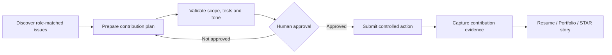
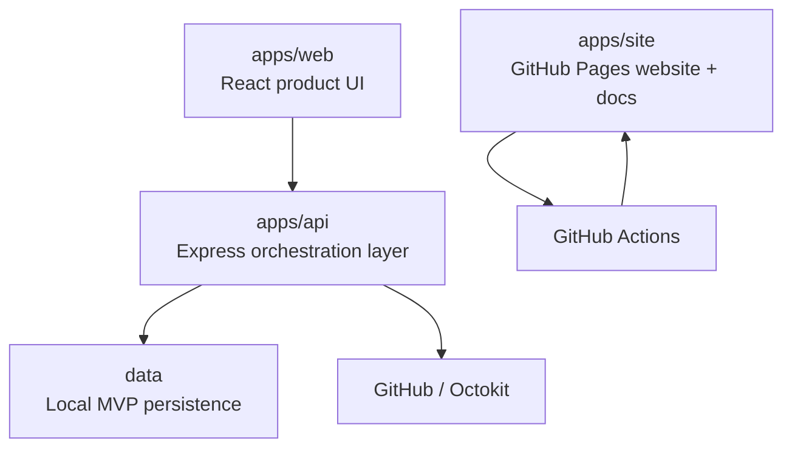

# ContributorOps

<p align="center">
  <picture>
    <source media="(prefers-color-scheme: dark)" srcset="./apps/site/public/contributorops-logo-dark.svg">
    <source media="(prefers-color-scheme: light)" srcset="./apps/site/public/contributorops-logo-light.svg">
    
  </picture>
</p>

<p align="center">
  <strong>Turn real open-source contributions into verifiable career proof.</strong>
</p>

<p align="center">
  <a href="https://ankitparekh007.github.io/contributorOps/"></a>
  <a href="./LICENSE"></a>
  
  
</p>

<p align="center">
  <a href="https://ankitparekh007.github.io/contributorOps/"><strong>Explore the live experience</strong></a>
  ·
  <a href="./CONTRIBUTING.md"><strong>Contribute</strong></a>
  ·
  <a href="./docs/safety-policy.md"><strong>Safety model</strong></a>
  ·
  <a href="./docs/roadmap.md"><strong>Roadmap</strong></a>
</p>

---

ContributorOps is an open-source contribution intelligence platform for developers who want to do meaningful OSS work and turn that work into evidence that hiring teams can understand.

Instead of optimizing for contribution volume, it helps a contributor move through a high-quality loop:

**Discover → Prepare → Validate → Prove**

- discover role-relevant contribution opportunities
- prepare scoped contribution plans and maintainer-friendly PR drafts
- validate quality, testing, tone, and submission readiness
- package completed work into portfolio evidence, resume bullets, STAR stories, and recruiter-ready summaries

> ContributorOps is intentionally **human-approved**. It is not a mass-commenting bot, mass-PR engine, or contribution-gaming tool.

## Why developers care

GitHub activity alone is often noisy. ContributorOps helps turn it into a repeatable professional workflow.

| Developer problem | ContributorOps response |
| --- | --- |
| “I do not know which OSS issue is worth my time.” | Role-aware issue discovery and scoring |
| “I lose context before I finish a contribution.” | Structured contribution plans and daily missions |
| “My PRs are technically fine but weakly communicated.” | PR quality and maintainer-readiness checks |
| “My contribution disappears into GitHub history.” | Proof-of-work portfolio and public contribution pages |
| “I struggle to explain OSS work in interviews.” | Resume bullets, LinkedIn drafts, and STAR stories |

If this is a workflow you would use, **star the repository**. If you want to experiment with a different contribution model, **fork it and build your own intelligence modules**.

## Why recruiters and engineering leaders care

ContributorOps is also a portfolio-grade architecture project that demonstrates more than UI work. The repository includes:

- a React + Vite + TypeScript product surface
- a Node.js + Express orchestration/API layer
- GitHub API integration through Octokit
- deterministic safety checks and approval-gated external writes
- scheduled planning workflows that are deliberately read-only toward third-party repositories
- local-first persistence for the MVP with clear production boundaries
- static product/documentation deployment through GitHub Actions and GitHub Pages
- product thinking across developer experience, trust, monetization, and hiring signal

For hiring teams, the project is designed around a simple idea: **evaluate the reasoning, scope, tests, and impact behind contributions—not just commit counts.**

## Live product preview

**Website:** https://ankitparekh007.github.io/contributorOps/

The public site includes the product story, feature model, safety approach, pricing architecture, roadmap, documentation, and recruiter/developer positioning.

The main product and API remain local-development surfaces while authentication, production persistence, and billing are still planned.

## Product workflow



## Architecture



### Repository map

```text
contributorOps/
├─ apps/
│  ├─ api/       # discovery, scoring, planning, storage, controlled GitHub operations
│  ├─ web/       # product application surface
│  └─ site/      # business site + documentation deployed to GitHub Pages
├─ data/         # local JSON-backed MVP state
├─ docs/         # product, safety, deployment, environment and roadmap docs
├─ .github/      # CI / Pages workflows and community configuration
└─ README.md
```

## Core capabilities

### Opportunity intelligence
- issue discovery across external repositories
- role-aware scoring and filtering
- daily contribution planning
- job/stack-oriented prioritization

### Contribution preparation
- scoped contribution plans
- likely file and testing suggestions
- maintainer-question drafting
- branch, commit, and PR draft generation

### Quality and trust controls
- PR quality scoring
- deterministic pre-submit checks
- duplicate-action prevention
- external write rate limits
- explicit approval gates for higher-risk operations
- audit logging for external write actions

### Proof-of-work packaging
- contribution portfolio tracking
- public contribution pages
- GitHub resume export
- LinkedIn post generation
- interview STAR story generation
- recruiter-facing summaries

## Safety model

ContributorOps has three operating modes:

1. **Research Mode** — discovery, scoring, and planning only; no external GitHub writes.
2. **Draft Mode** — local proposal generation for changes, PR copy, and tests; no submission.
3. **Approved Auto-Contribute Mode** — exact comments, branches, and draft PR actions require explicit human approval.

Scheduled workflows are restricted to internal planning and repository-local automation. External repository writes remain approval-gated.

Read the full policy in [`docs/safety-policy.md`](./docs/safety-policy.md).

## Quick start

### Prerequisites
- Node.js 20+
- npm 10+

### Install

```bash
git clone https://github.com/AnkitParekh007/contributorOps.git
cd contributorOps
npm install
```

### Run the product

```bash
npm run dev
```

### Run the public site

```bash
npm run site:dev
```

### Validate the workspace

```bash
npm run typecheck
npm run build:all
```

Environment setup is documented in [`docs/environment-setup.md`](./docs/environment-setup.md).

## Current project status

| Area | Status |
| --- | --- |
| Static marketing + documentation site | ✅ Live |
| Discovery and planning workflows | ✅ Implemented |
| Controlled contribution modes | ✅ Implemented |
| Local-first portfolio tracking | ✅ Implemented |
| Safety policy + approval model | ✅ Implemented |
| Real billing/payments | 🟡 Planned |
| Per-user GitHub OAuth | 🟡 Planned |
| Production database | 🟡 Planned |
| Multi-user SaaS operations | 🟡 Planned |

ContributorOps should be treated as a **working open-source product foundation and architecture showcase**, not a production SaaS claim.

## Contributing

Contributions are welcome—especially changes that improve developer experience, contribution quality, explainability, testing, accessibility, and recruiter-facing proof.

A good contribution path is:

1. read [`CONTRIBUTING.md`](./CONTRIBUTING.md)
2. read the [`Safety Policy`](./docs/safety-policy.md) if your change touches GitHub automation
3. choose a focused issue or propose one
4. run `npm run typecheck` and `npm run build:all`
5. open a focused PR that explains user impact and how safety constraints are preserved

See also [`CODE_OF_CONDUCT.md`](./CODE_OF_CONDUCT.md).

## Roadmap

### Foundation
- business website and documentation
- GitHub Pages deployment
- daily contribution planning
- portfolio tracking

### Professional workflow
- job-matched issue finding
- PR quality review
- resume generation
- LinkedIn artifact generation
- public proof-of-work pages

### Career layer
- GitHub profile audit
- interview story generation
- recruiter share workflows
- weekly career reporting

### Team layer
- team dashboard
- bootcamp mode
- maintainer quality analytics
- shared contribution radar

Full roadmap: [`docs/roadmap.md`](./docs/roadmap.md)

## Project principles

ContributorOps prioritizes:

- **quality over contribution volume**
- **professional evidence over vanity activity**
- **human approval over opaque automation**
- **maintainer trust over growth mechanics**
- **explainable engineering work over empty GitHub metrics**

## License

BSD 3-Clause. See [`LICENSE`](./LICENSE).

---

<p align="center">
  <strong>If ContributorOps is useful or interesting, star it, fork it, or open an issue with the workflow you want to see next.</strong>
</p>
