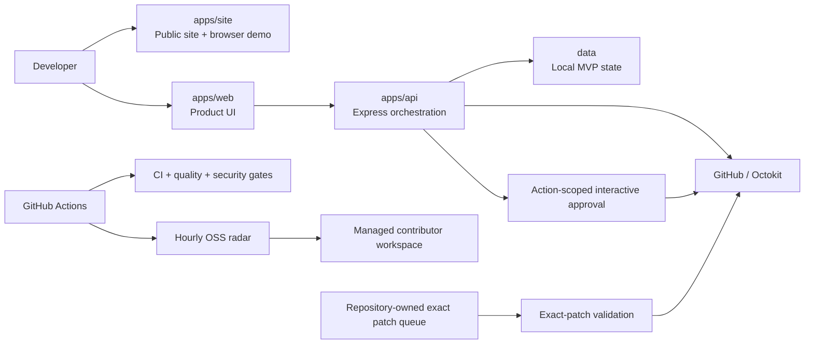

# ContributorOps

<p align="center">
  <picture>
    <source media="(prefers-color-scheme: dark)" srcset="./apps/site/public/contributorops-logo-dark.svg">
    <source media="(prefers-color-scheme: light)" srcset="./apps/site/public/contributorops-logo-light.svg">
    
  </picture>
</p>

<p align="center">
  <strong>Turn meaningful open-source contributions into verifiable career proof.</strong>
</p>

<p align="center">
  <a href="https://github.com/AnkitParekh007/contributorOps/actions/workflows/ci.yml"></a>
  <a href="https://ankitparekh007.github.io/contributorOps/"></a>
  <a href="https://github.com/AnkitParekh007/contributorOps/stargazers"></a>
  <a href="https://github.com/AnkitParekh007/contributorOps/forks"></a>
  <a href="https://github.com/AnkitParekh007/contributorOps/issues"></a>
  <a href="./LICENSE"></a>
</p>

<p align="center">
  <a href="https://ankitparekh007.github.io/contributorOps/#/demo"><strong>Browser demo</strong></a>
  ·
  <a href="https://ankitparekh007.github.io/contributorOps/#/launch"><strong>Launch hub</strong></a>
  ·
  <a href="https://ankitparekh007.github.io/contributorOps/#/try"><strong>Run the real app</strong></a>
  ·
  <a href="https://ankitparekh007.github.io/contributorOps/#/showcase"><strong>Engineering showcase</strong></a>
  ·
  <a href="https://ankitparekh007.github.io/contributorOps/#/recruiter"><strong>Recruiter brief</strong></a>
  ·
  <a href="https://ankitparekh007.github.io/contributorOps/#/safety"><strong>Safety</strong></a>
  ·
  <a href="https://ankitparekh007.github.io/contributorOps/#/contribute"><strong>Contribute</strong></a>
</p>

---

ContributorOps is an open-source contribution intelligence platform for developers who want to do meaningful OSS work and turn that work into evidence that maintainers and hiring teams can understand.

The core loop is:

**Discover → Prepare → Validate → Authorize → Prove**

- **Discover** role-relevant contribution opportunities.
- **Prepare** scoped change plans, tests, maintainer context, and PR narrative.
- **Validate** scope, quality, repository policy, duplicates, and submission readiness.
- **Authorize** maintainer-facing writes through explicit, bounded authority paths.
- **Prove** completed work through portfolio evidence, resume bullets, and interview stories.

> ContributorOps is intentionally **not** a mass-commenting bot, mass-PR engine, or contribution-gaming system. Maintainer trust is an architecture constraint.

## Try it before you trust it

The fastest evaluation path is the [browser demo](https://ankitparekh007.github.io/contributorOps/#/demo). It requires no signup, no GitHub token, and no repository access.

The demo uses explicitly fictional examples and walks through:

1. issue discovery and role-fit scoring
2. focused file/test planning
3. deterministic quality checks
4. interactive versus standing authorization boundaries
5. recruiter-readable proof-of-work output

Want the real product instead of the walkthrough?

[](https://codespaces.new/AnkitParekh007/contributorOps?quickstart=1)

The Codespaces/local default remains demo-safe: no GitHub token is required and external contribution execution is disabled unless the operator explicitly configures it.

## Why this repository is different

ContributorOps makes the product story **inspectable**. The architecture, trust boundaries, quality gates, launch rules, and adoption signals are public rather than hidden behind marketing claims.

| Evidence | What it demonstrates |
| --- | --- |
| [Browser Demo](https://ankitparekh007.github.io/contributorOps/#/demo) | immediate no-signup product evaluation with clearly fictional scenarios |
| [Launch Hub](https://ankitparekh007.github.io/contributorOps/#/launch) | audience-specific evaluation paths for developers, recruiters, and maintainers |
| [`docs/architecture.md`](./docs/architecture.md) | system surfaces, data flow, CI, deployment, and production evolution |
| [`docs/security-model.md`](./docs/security-model.md) | interactive action-scoped approval and standing exact-patch authorization boundaries |
| [`docs/adr/`](./docs/adr/README.md) | durable reasoning behind high-impact architecture choices |
| [`docs/safety-policy.md`](./docs/safety-policy.md) | anti-spam rules, repository-policy checks, exact-patch constraints, and rate limits |
| [`docs/quality-gates.md`](./docs/quality-gates.md) | deterministic route/metadata checks, Lighthouse budgets, TypeScript/build gates, and limits |
| [CI workflow](./.github/workflows/ci.yml) | API/Web/Site builds, trust tests, dependency audits, secret scanning, and site-quality enforcement |
| [CodeQL workflow](./.github/workflows/codeql.yml) | JavaScript/TypeScript static security analysis |
| [Engineering Showcase](https://ankitparekh007.github.io/contributorOps/#/showcase) | how the implementation maps to engineering evidence |
| [Recruiter Brief](https://ankitparekh007.github.io/contributorOps/#/recruiter) | a two-minute path from product story to source-level proof |
| [Adoption Dashboard](https://ankitparekh007.github.io/contributorOps/#/adoption) | live public GitHub signals without invented customer or user claims |
| [`docs/phase-8-launch-execution.md`](./docs/phase-8-launch-execution.md) | launch packets, channel rules, 60-second demo, measurement, and anti-gaming policy |

## Authorization model

A generated plan is **never authority by itself**.

ContributorOps supports two intentionally separate paths for maintainer-facing execution.

### 1. Interactive action-scoped approval

Interactive contribution runs follow:

```text
prepare → inspect exact payload → approve exact action → execute → retain audit event
```

New runs receive separate approval capabilities for:

- comment
- fork branch
- draft PR

A capability for one action cannot authorize another. Legacy generic run tokens fail closed for new writes.

### 2. Standing exact-patch authorization

The operator can separately enable a repository-owned exact-patch queue for bounded unattended execution.

A queued patch must already contain the concrete files, exact replacements, commit metadata, PR copy, and test evidence. Before execution ContributorOps re-checks:

- open/non-archived repository and issue state
- detected repository policy, including AI-contribution prohibitions
- existing PRs referencing the issue
- same-repository/day duplication
- global daily PR cap
- safe paths and bounded file/replacement scope
- exact single-match replacement against current source

Ambiguity or source drift fails closed. Successful standing submissions remain **draft pull requests** and include automation disclosure.

Read [`docs/security-model.md`](./docs/security-model.md) and [`docs/safety-policy.md`](./docs/safety-policy.md).

## Architecture at a glance



The project originally established human-approved interactive writes in [ADR-0001](./docs/adr/0001-human-approved-external-writes.md). The current [security model](./docs/security-model.md) documents how that interactive path coexists with the separately authorized exact-patch queue.

## Repository map

```text
contributorOps/
├─ .devcontainer/ # one-click Codespaces environment
├─ apps/
│  ├─ api/        # discovery, scoring, planning, GitHub safety + execution paths
│  ├─ web/        # interactive product application
│  └─ site/       # public product, demo, launch, recruiter, adoption, quality, safety
├─ data/           # local MVP state + standing patch queue inputs/results
├─ docs/
│  ├─ adr/         # architecture decision records
│  └─ ...          # architecture, safety, quality, adoption, launch, distribution
├─ scripts/        # deterministic site-quality and Lighthouse harnesses
├─ .github/        # CI, CodeQL, dependency review, Pages, radar, patch-queue workflows
├─ lighthouserc.json
├─ CHANGELOG.md
├─ CITATION.cff
├─ CONTRIBUTORS.md
└─ README.md
```

## Core capabilities

### Opportunity intelligence
- issue discovery across external repositories
- role-aware scoring and filtering
- daily/hourly contribution radar
- stack-oriented prioritization

### Contribution preparation
- scoped contribution plans
- likely file and testing suggestions
- maintainer-question drafting
- branch, commit, and PR draft generation
- managed contributor forks/workspaces
- bounded executable exact-patch plans

### Quality, trust, and security
- PR quality scoring
- deterministic pre-submit checks
- action-scoped interactive approvals
- exact-patch standing authorization
- repository-policy and duplicate checks
- per-repository and global daily limits
- draft-only standing submissions
- auditable approval/run state
- runtime high/critical npm audit merge gate
- full dependency audit reporting
- CodeQL static analysis
- Dependabot update policy
- optional Dependency Review hard gate when GitHub Dependency Graph is enabled
- CycloneDX SBOM generation
- route/metadata integrity validation
- Lighthouse quality budgets
- API/Web/Site TypeScript and build checks

### Proof-of-work packaging
- contribution portfolio tracking
- public contribution pages
- GitHub resume export
- LinkedIn draft generation
- interview STAR story generation
- recruiter-facing summaries

### Adoption and launch operations
- browser-only no-signup demo
- local/Codespaces real-app evaluation
- public Launch Hub
- live GitHub adoption dashboard
- optional privacy-first analytics, disabled by default
- audience-specific Share Hub
- structured workflow-feedback intake
- contributor-retention playbook
- channel-specific public launch execution guide

## Quick start

### Prerequisites
- Node.js 20+
- npm 10+

### Install

```bash
git clone https://github.com/AnkitParekh007/contributorOps.git
cd contributorOps
npm ci
```

### Run API + product UI

```bash
npm run dev
```

Without a GitHub token, the product can use its demo discovery path; authenticated GitHub actions remain unavailable.

### Run the public site

```bash
npm run site:dev
```

### Validate the workspace

```bash
npm run test:api
npm run typecheck
npm run build:all
npm run site:quality
npm run site:lighthouse
npm run security:audit:runtime
```

See [`docs/environment-setup.md`](./docs/environment-setup.md) and [`docs/local-development.md`](./docs/local-development.md).

## Current project boundary

| Area | Status |
| --- | --- |
| Public product + documentation site | ✅ Live |
| Browser-only no-signup walkthrough | ✅ Implemented |
| Local / Codespaces real-app path | ✅ Implemented |
| Engineering showcase + recruiter brief | ✅ Implemented |
| Public Launch Hub | ✅ Implemented |
| Audience-specific Share Hub | ✅ Implemented |
| Public GitHub adoption dashboard | ✅ Implemented |
| Public Quality Gates surface | ✅ Implemented |
| Route-level metadata + site-quality gate | ✅ Implemented |
| Lighthouse quality budgets | ✅ Implemented |
| Interactive action-scoped approval | ✅ Implemented |
| Standing exact-patch authorization | ✅ Implemented |
| Managed contributor workspace / forks | ✅ Implemented |
| Runtime dependency-security gate | ✅ Implemented |
| CodeQL + Dependabot | ✅ Implemented |
| Safety/security/architecture documentation | ✅ Implemented |
| Distribution + launch execution playbooks | ✅ Implemented |
| Optional privacy-first site analytics hook | ✅ Implemented, disabled by default |
| GitHub Dependency Review hard gate | 🟡 Workflow ready; Dependency Graph must be enabled in repository settings |
| Real billing/payments | 🟡 Planned |
| Per-user GitHub OAuth | 🟡 Planned |
| Production multi-user database | 🟡 Planned |
| Hosted multi-user SaaS operations | 🟡 Planned |

ContributorOps is a **working open-source product and engineering architecture showcase**, not a claim that a hosted production SaaS is already operating.

## Contributing

The fastest contribution path:

1. open the [public Contribute page](https://ankitparekh007.github.io/contributorOps/#/contribute)
2. browse [`good first issue`](https://github.com/AnkitParekh007/contributorOps/issues?q=is%3Aissue+is%3Aopen+label%3A%22good+first+issue%22) or [`help wanted`](https://github.com/AnkitParekh007/contributorOps/issues?q=is%3Aissue+is%3Aopen+label%3A%22help+wanted%22)
3. read [`CONTRIBUTING.md`](./CONTRIBUTING.md)
4. read the [Safety Policy](./docs/safety-policy.md) before changing GitHub automation
5. run the relevant tests, type checks, builds, and quality gates
6. open a focused PR explaining user impact and safety implications

Contributor recognition is described in [`CONTRIBUTORS.md`](./CONTRIBUTORS.md), and repeat-contributor practices are in [`docs/contributor-retention.md`](./docs/contributor-retention.md).

Tried the workflow but do not have a code change yet? Use the **Workflow feedback** issue template to report one concrete point of friction or improvement.

## Measure, launch, learn

- [Launch Hub](https://ankitparekh007.github.io/contributorOps/#/launch) — shortest evaluation path by audience
- [Adoption Dashboard](https://ankitparekh007.github.io/contributorOps/#/adoption) — live public GitHub signals
- [`docs/phase-8-launch-execution.md`](./docs/phase-8-launch-execution.md) — current launch packets and execution rules
- [`docs/adoption-scorecard.md`](./docs/adoption-scorecard.md) — GitHub traffic + adoption measurement model
- [`docs/distribution-playbook.md`](./docs/distribution-playbook.md) — audience, conversion, and anti-spam rules
- [`docs/share-kit.md`](./docs/share-kit.md) — canonical copy and technical article angles
- [Share Hub](https://ankitparekh007.github.io/contributorOps/#/share) — audience-specific share links

The measurement system deliberately separates repository engagement from customer/user claims and keeps optional site analytics disabled unless explicitly configured.

## Project principles

ContributorOps prioritizes:

- **quality over contribution volume**
- **professional evidence over vanity activity**
- **explicit authorization over opaque automation**
- **maintainer trust over growth mechanics**
- **fail-closed exactness over unattended guessing**
- **explainable engineering work over empty GitHub metrics**
- **audience-specific distribution over mass promotion**
- **measurable learning over invented traction**
- **enforced quality gates over unverifiable engineering claims**

## License

BSD 3-Clause. See [`LICENSE`](./LICENSE).

---

<p align="center">
  <strong>Try the browser demo. Inspect the source. Challenge the safety model. Contribute if you can make it better.</strong>
</p>
