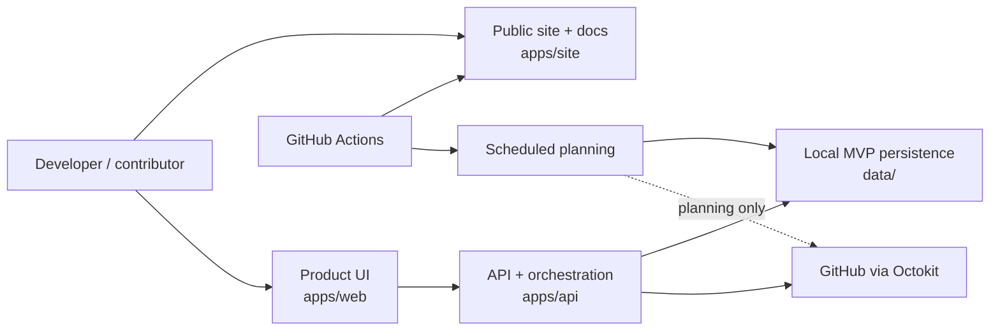
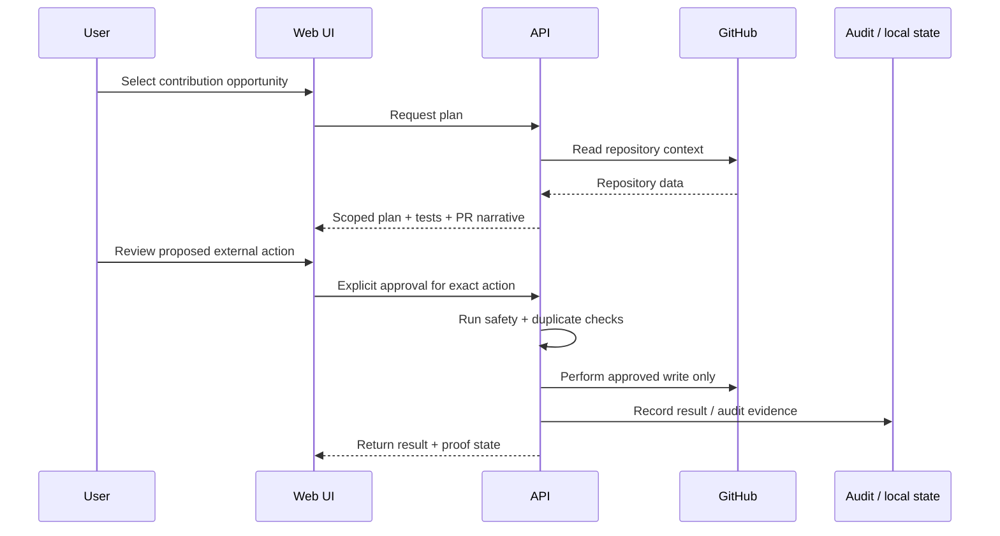

# ContributorOps Architecture

ContributorOps is a monorepo with three product/runtime surfaces and one deliberately narrow trust boundary around external GitHub writes.

This document is the fastest way for a developer, maintainer, or hiring team to understand how the project is structured, how data moves, and why its safety constraints exist.

## System context

## Repository surfaces

### `apps/site`

React + Vite + TypeScript public product surface deployed to GitHub Pages.

Responsibilities:
- product positioning and feature explanation
- public documentation
- contribution onboarding
- recruiter-readable engineering proof
- safety and roadmap communication

### `apps/web`

React + Vite + TypeScript interactive product UI.

Responsibilities:
- opportunity discovery and scoring views
- contribution planning UX
- contribution-control workflows
- portfolio and proof-of-work workflows
- calls into the API orchestration layer

### `apps/api`

Node.js + Express + TypeScript backend and GitHub integration boundary.

Responsibilities:
- GitHub discovery through Octokit
- issue scoring and daily planning
- portfolio/state persistence
- contribution preparation
- deterministic guardrails before higher-risk external actions
- audit evidence for controlled writes

### `data`

Local JSON-backed MVP persistence. This is an explicit product-foundation choice, not a claim of production multi-user storage.

The persistence boundary is intentionally replaceable so a production database can be introduced without changing the core trust model.

## Contribution sequence

## Trust boundaries

### 1. Read access is not write permission

Discovery, scoring, and planning may inspect repository context. They do not imply permission to create comments, branches, commits, or pull requests.

### 2. External writes require explicit human approval

Higher-risk actions must cross the approval boundary for the exact requested operation. The safety policy is a product invariant rather than a UI convention.

### 3. Scheduled jobs are planning-only toward third-party repositories

Scheduled workflows may refresh research and plans, but they must not create unattended external repository activity.

### 4. Auditability is part of the feature

Controlled external actions should leave enough evidence to explain what was requested, what was approved, and what happened.

## Architecture qualities

| Quality | Design response |
| --- | --- |
| Maintainer trust | Human approval before external writes |
| Explainability | Scored opportunities, structured plans, visible proof |
| Safe iteration | Local-first persistence and explicit production boundaries |
| Deployability | Static GitHub Pages site + conventional Node API |
| Contributor accessibility | Monorepo scripts, docs, good-first-issue funnel, CI checks |
| Hiring signal | Architecture, ADRs, safety model, tests, and proof surfaces are public |

## CI and deployment

Pull requests to `main` are validated with:
- dependency installation
- API build
- Web build
- Site build
- TypeScript checks across all three apps
- a basic secret-pattern scan

The public site is built from `apps/site` and deployed through GitHub Actions to GitHub Pages after changes reach `main`.

## Architecture Decision Records

Key decisions live under [`docs/adr`](./adr/README.md):

- ADR-0001 — Human-approved external GitHub writes
- ADR-0002 — Local-first persistence for the MVP
- ADR-0003 — GitHub Pages for the public product/documentation site

## Current product boundary

ContributorOps should be treated as a working open-source product foundation and architecture showcase rather than a production SaaS claim.

Likely production changes include:
- per-user authentication and GitHub OAuth
- a production database with tenant boundaries
- durable background job orchestration
- production secret management
- observability and rate-limit telemetry
- billing/payment integration

Those changes should preserve the external-write approval invariant unless a future architecture decision explicitly replaces it.