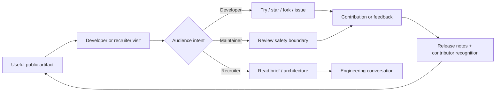

# ContributorOps Distribution Playbook

This playbook defines how to grow ContributorOps without turning distribution into spam or optimizing the product around vanity metrics.

## Objective

Create a repeatable path from **discovery → useful visit → star/fork → contribution → long-term advocate**.

The project should grow because the workflow, engineering decisions, and contribution opportunities are useful—not because people are coordinated to inflate engagement.

## Growth loop

## 1. GitHub-native discovery first

Before external launch pushes:

- keep the README current and concise
- keep CI green
- maintain at least three approachable `good first issue` items
- use accurate repository topics
- keep the website URL and repository description current
- keep the native GitHub social preview aligned with the public site
- publish meaningful releases when a phase or capability materially changes

Recommended topics:

`open-source`, `developer-tools`, `github`, `typescript`, `react`, `nodejs`, `career`, `portfolio`, `pull-requests`, `ai-tools`

GitHub topics are a discovery surface: they help people browse related repositories and find projects to contribute to.

## 2. Audience-specific entry points

Do not send every visitor to the homepage.

| Audience | Best link | Primary ask |
| --- | --- | --- |
| Developer | `/#/contribute` | try, fork, or pick a focused issue |
| Recruiter / hiring manager | `/#/recruiter` | evaluate engineering decisions |
| Maintainer | `/#/safety` | critique the approval/trust boundary |
| Developer community | `/#/showcase` | feedback on workflow and proof model |
| General GitHub visitor | repository README | star only if useful; explore source |

Use `/#/share` to generate/copy audience-specific messages.

## 3. Launch sequence

### Wave A — GitHub readiness

1. Merge only when CI is green.
2. Update About description, website URL, topics, and social preview.
3. Ensure starter issues are available.
4. Publish a meaningful GitHub release for the launch phase.
5. Verify live pages after deployment.

### Wave B — professional network

Use LinkedIn first when the strongest hook is engineering/product architecture.

Lead with:
- the problem being solved
- the human-approved trust boundary
- architecture decisions made public
- a concrete request for technical feedback

Best link: recruiter brief or engineering showcase depending on audience.

### Wave C — technical article

Publish one deep technical article rather than multiple shallow announcements.

Recommended angles:
- why ContributorOps refuses unattended third-party PR automation
- architecture of a local-first contribution assistant
- turning open-source work into explainable proof-of-work
- designing approval gates around external GitHub writes

Link the article back to the relevant ADR and repository.

### Wave D — developer communities

Community posts should be discussion-first, transparent about ownership, and tailored to the community.

Ask questions such as:
- Does this workflow improve contribution quality or add unnecessary process?
- Is the human-approval boundary strict enough?
- What evidence would make an OSS contribution more useful during hiring?

Do not cross-post identical promotional copy across many communities on the same day.

### Wave E — Show HN only when the tool is directly tryable

Show HN is appropriate only when people can meaningfully try the project, ideally without a signup barrier. A static landing page or waitlist is not enough.

Before posting:
- confirm the product can be cloned/run or otherwise tried immediately
- make setup friction low
- stay available to answer technical questions
- do not ask friends or communities for coordinated upvotes/comments

## 4. Release-driven distribution

Treat meaningful product phases as releases.

A release should contain:
- what materially changed
- why it matters
- architecture or safety implications
- contributor acknowledgements
- screenshots/demo link when useful
- known limitations / current boundaries

Use `.github/release.yml` to keep generated release notes consistent.

## 5. Conversion targets

Track the funnel qualitatively and quantitatively:

1. **Visit → repository exploration**
   - repository traffic
   - docs / recruiter / contribute visits where measurable

2. **Repository exploration → lightweight intent**
   - stars
   - forks
   - issue comments/questions

3. **Intent → contribution**
   - good-first-issue claims
   - issue-to-PR conversion
   - external PRs

4. **Contribution → advocacy**
   - repeat contributors
   - contributor mentions in releases
   - architecture feedback
   - referrals from recruiters/developers

Stars are useful discovery signals, but they are not product-quality proof by themselves.

## 6. Weekly operating cadence

### Monday
- review GitHub traffic, stars/forks, issue activity, and contributor questions
- make sure at least three approachable issues remain open

### Wednesday
- publish or improve one durable artifact: ADR, technical note, demo, issue, or example proof

### Friday
- share one audience-specific artifact if there is something genuinely new or useful
- thank contributors and close stale issue loops

Avoid posting solely because a calendar says to post.

## 7. Distribution quality rules

Do:
- tailor every message to one audience
- link directly to evidence
- ask for concrete feedback
- disclose example/demo data
- state production boundaries
- credit contributors

Do not:
- buy stars, followers, comments, or upvotes
- ask communities for coordinated engagement
- invent testimonials, usage counts, or recruiter outcomes
- automate mass promotional posting
- optimize contribution automation for volume at maintainer expense

## 8. Phase 4 success criteria

Phase 4 is working when:
- the public site has a usable share hub
- repository releases are repeatable
- GitHub citation metadata exists
- the launch sequence is documented
- starter contributions remain available
- recruiter/developer/maintainer audiences each have a direct path
- growth activity preserves the human-approved trust model
